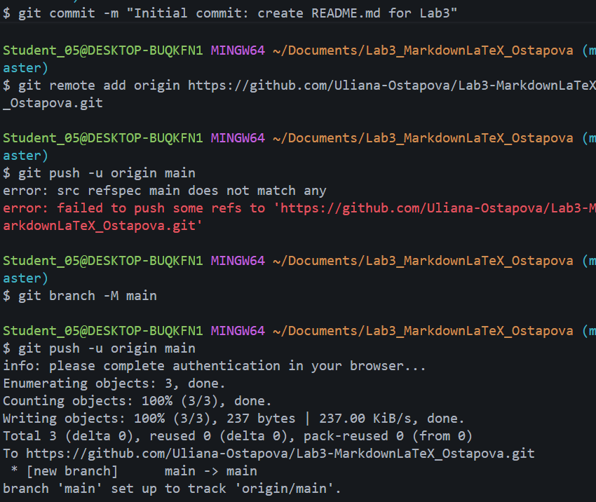

# Лабораторная работа №3. Работа с Markdown-разметкой и базовое использование LaTeX в документации проекта

## Описание

В данной лабораторной работе изучается Markdown-разметка и базовое использование LaTeX.
В ходе работы были рассмотрены заголовки, списки, таблицы, ссылки, изображения, цитаты и блоки кода.
Также были изучены математические формулы и основные конструкции LaTeX.

## Содержание

- [О лабораторной работе](#описание)
- [Структура проекта](#структура-проекта)
- [Markdown](#markdown)
- [Таблица](#таблица)
- [Изображение](#изображение)
- [Ссылки](#ссылки)
- [Чекбоксы](#чекбоксы)
- [Сноска](#сноска)
- [Alert-блоки GitHub](#alert-блоки-github)
- [Inline LaTeX](#inline-latex)
- [Block LaTeX](#block-latex)

## Структура проекта

1. `README.md` — основной файл проекта
2. `docs/` — Markdown-файлы с примерами
    - `formattingLab3_Ostapova.md`
    - `separatorsLab3_Ostapova.md`
    - `codeQuotesLab3_Ostapova.md`
    - `tablesLab3_Ostapova.md`
    - `advancedMarkdownLab3_Ostapova.md`
    - `headersLab3_Ostapova.md`
    - `latexLab3_Ostapova.md`
    - `linksImagesLab3_Ostapova.md`
    - `listsLab3_Ostapova.md`
    - `ReadMePushLab3_Ostapova.md`
3. `img/` — скриншоты коммитов и push
---
# Markdown
___
# Заголовок H1
## Заголовок H2
### Заголовок H3
___

### Форматирование текста
- **Полужирный текст**
- *Курсивный текст*
- ~~Зачёркнутый текст~~
- `Моноширный текст`

### Списки
Маркированный список:

- Markdown
- Git
- GitHub

Нумерованный список:

1. Создать файл
2. Добавить содержимое
3. Сделать коммит
4. Выполнить push

Вложенный список:

1. Markdown
    - Заголовки
    - Таблицы
    - Списки
2. LaTeX
    - Формулы
    - Дроби
    - Корни

### Цитата
> Markdown используется для оформления документации и README-файлов.

### Блок кода
```python
language = "Python"
print(f"Язык программирования: {language}")
```
### Таблица
|Функция | Команда Git | Описание|
|:-------|:-----------:|--------:|
|Создание репозитория|**git init**|Инициализация репозитория|
|Просмотр состояния	|**git status**|Показывает изменённые файлы|
|Отправка на GitHub	|**git push**|Загружает коммиты на сервер|

### Изображение


### Ссылки
- Внешняя:[Blender] (https://www.blender.org/ "Перейти на официальный сайт")
- Внутренняя: [Таблица](#таблица)

### Чекбоксы
- [ ] **Изучить** продвинутые возможности Markdown
- [x] *Практиковать* создание таблиц и списков
- [ ] ***Реализовать*** задание по программированию
- [ ] ~~Отложить~~ **Завершить** оформление документации

### Сноска
Markdown полезен в разработке[^1]
[^1]: Синтаксис Markdown поддерживается на GitHub, GitLab, в большинстве редакторов кода и систем документирования.

### Alert-блоки GitHub
>[!NOTE]
Пример простой заметки

>[!TIP]
Пример блока с полезным советом

>[!WARNING]
Пример блока с предупреждением

### Inline LaTeX
**Пример:**
Площадь круга: $S = \pi r^2$ 
### Block LaTeX
**Пример:**
$$\sum_{i=1}^n i = \frac{n(n+1)}{2}$$
